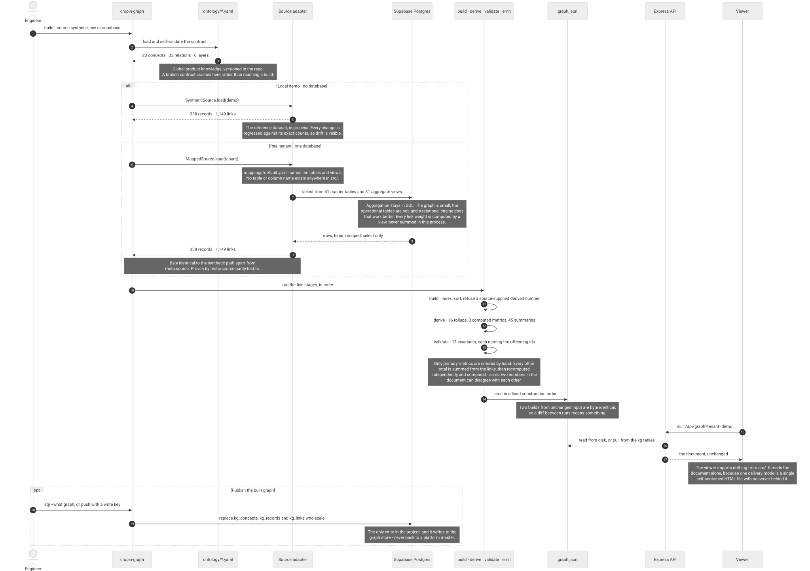
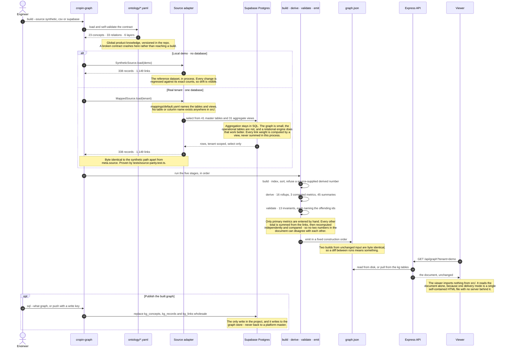
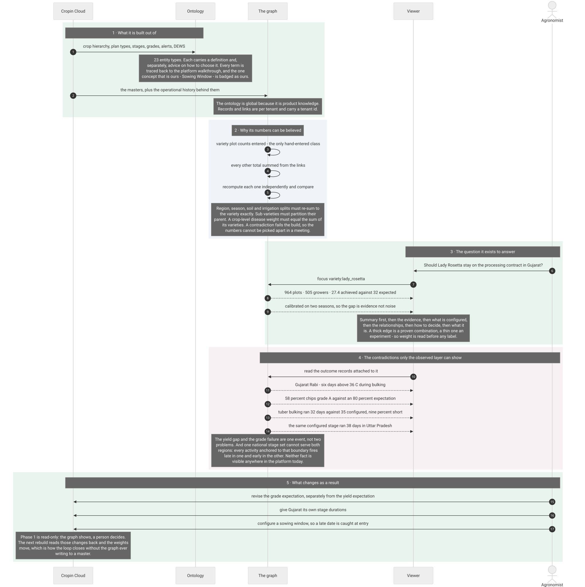
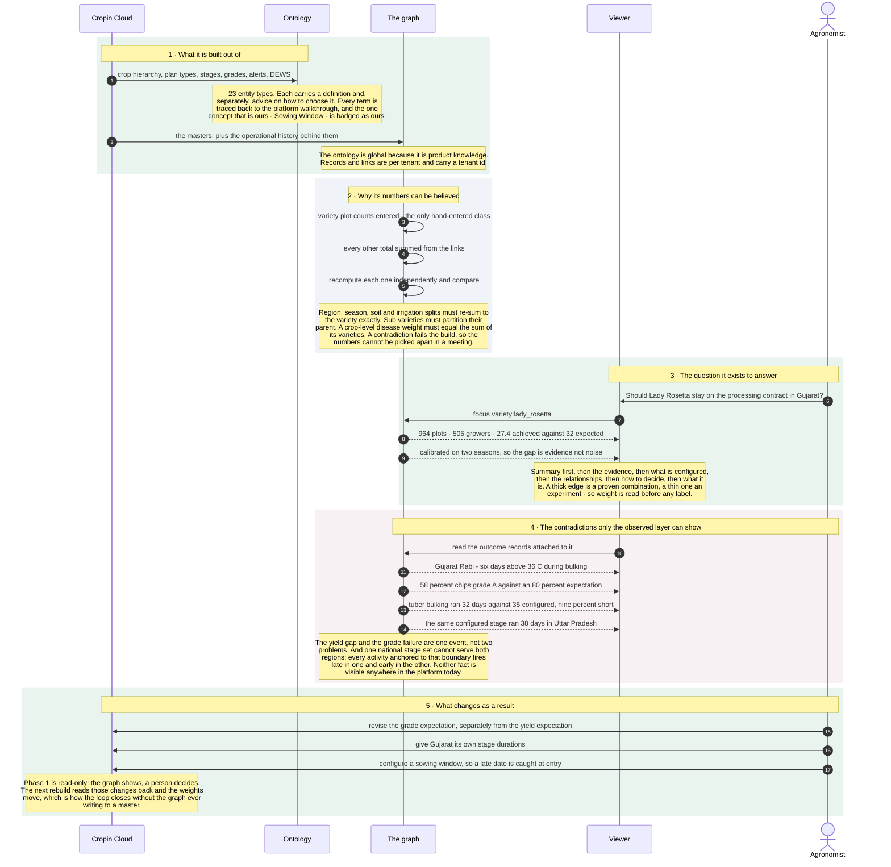

# Cropin configuration-assist knowledge graph

A graph that answers one question: **what should I configure, and what does our own history say about
that choice?**

It reports *over* the Cropin Cloud masters. Crops, varieties, growth stages, plans, activities, risks -
each one carrying the plot counts behind it, so a configuration decision can be read against what
actually happened rather than against an opinion.

---

## Architecture

Both diagrams are mermaid `sequenceDiagram` blocks, committed as SVG next to their source. The SVG is
what the README shows, because mermaid only renders on github.com - a markdown preview in an editor
shows the raw source instead. The source stays in a collapsed block under each diagram, and
`npm run docs:diagrams` regenerates the SVG and a PNG from it.

The same five stages run whether there is a database or not. Only the source adapter changes, and the
two paths are required to produce the *same document* - that equality is a test, and it is what caught
the two real defects in the mapping layer.



<details>
<summary>Mermaid source for this diagram</summary>


</details>

---

## The whole flow, and why each part of it exists

What it is built out of, why its numbers can be believed, the question it answers, the contradictions
only it can see, and what changes as a result.



<details>
<summary>Mermaid source for this diagram</summary>


</details>

---

## Quick start

```bash
npm install

# 1. Build the reference tenant from the synthetic source (no database needed)
npm run build:demo

# 2. Build the viewer, then serve both
npm run build:viewer
npm run api                 # http://localhost:8787

# 3. Check everything
npm run check               # typecheck + 87 unit tests
npm run test:viewer         # headless browser smoke test + screenshots
```

`npm run build:demo` prints:

```
  ontology     23 concepts, 33 relations, 6 layers           ok
  source       synthetic                                     338 records, 1,149 links
  derive       16 rollups, 3 computed, 45 summaries          ok
  validate     13 invariants                                 ok
  emit         dist/demo/graph.json (355 KB)
  graph        1 component, longest path 7, mean 3.3
  coverage     191 unweighted links, 0 empty concepts        see meta.coverage
```

### Against a real database

```bash
cp .env.example .env                     # fill in the Supabase values

# once, in the Supabase SQL editor:
#   supabase/schema.sql                  # masters, aggregate views, graph store, RLS
#   supabase/seed_masters_demo.sql       # generated by: npm run sql:masters

npm run build:supabase                   # reads the masters through mappings/default.yaml
npm run graph -- sql --what graph        # SQL to push the built graph into kg_*
npm run graph -- push                    # or push directly, if you have a write key
npm run graph -- pull --tenant demo      # read a stored graph back out
```

This path is verified rather than assumed. Reading 41 master tables and 31 aggregate views through
`mappings/default.yaml` produces a document **byte identical** to the in-process reference catalog, apart
from `meta.source` and `meta.built_at`:

```
  source       supabase:demo                                 338 records, 1,149 links
  validate     13 invariants                                 ok
  graph        1 component, longest path 7, mean 3.3

$ npm run graph -- diff dist/supabase/graph.json dist/demo/graph.json
  records      +0 -0 ~0
  links        +0 -0 reweighted 0
```

`tests/source-parity.test.ts` asserts it, and skips when no credentials are present. It is what caught the
two real defects in the mapping layer: a null column shipping the literal string `{note}` as prose, and a
note one source computed that a column-driven mapping could not know about.

---

## The two ideas worth knowing

### The evidence rule

Exactly one class of number is entered by hand: **the primary metrics**, declared in
`ontology/derivations.yaml`. Every other total on the graph is **summed from the links at build time**.

Because of that, no two numbers in the emitted document can contradict each other - and it is tested,
not asserted. A crop's plot count is recomputed independently of the derivation engine and compared; a
variety's regional, seasonal, soil and irrigation splits must re-sum to exactly that variety's own
count; where sub varieties exist they must partition their parent; the crop-level statement of a disease
must equal the sum of its varieties.

Edge thickness is the historical plot count behind a pairing. A thick link is a proven combination; a
thin one is an experiment.

### Two tiers, one graph

Every node is either a **concept** (an entity type with a definition and advice on how to choose it) or
a **record** (an actual configured or observed value). Both live in the same graph and both are
navigable, because the two questions a user has are simultaneous:

- *What is a harvest grade, and how should I decide it?* → concept
- *Which harvest grades do we already use for potato, and on how many plots?* → records

---

## Layout of the repository

```
ontology/                 Global product knowledge. Version controlled, identical for every tenant.
  concepts.yaml           23 concepts: definition, decide, source table, attribute order
  relations.yaml          33 relations: both display headings, order, weighting, valid concept pairs
  layers.yaml             6 layers
  derivations.yaml        which metrics are entered, which are summed, and the rules that prove it
  summaries.yaml          one generated-summary template per concept that has one
  nomenclature.md         every term traced to the platform walkthrough, with the divergences named

src/core/                 The pipeline. Knows nothing about any particular table.
  model.ts                the document contract, as zod schemas
  ontology.ts             loads and self-validates the YAML at import
  build.ts derive.ts validate.ts emit.ts pipeline.ts
  expr.ts                 a small non-eval evaluator for the computed-metric rules
  traverse.ts summaries.ts

src/mapping/              The declarative mapping contract, and how rows become records and links
src/sources/              synthetic (the reference dataset), csv (fixtures), supabase (real work)
src/store/                the kg_* graph store, and SQL emitters for seeding and pushing
src/server/               Express API over built documents
src/cli/                  build, validate, explain, route, diff, sql, push, pull, tenants, ontology

mappings/                 The file a new tenant edits. One per tenant.
supabase/schema.sql       Master tables, aggregate views, the graph store, RLS and grants
viewer/                   Vite + React viewer. Reads the emitted document and nothing else.
tests/                    invariants, derivations, layouts, traversal, and a browser smoke test
```

---

## The CLI

```bash
npm run graph -- build    --source synthetic --tenant demo --out dist/demo/graph.json --pretty --parity
npm run graph -- build    --source csv --mapping mappings/acme-csv.yaml --out dist/acme/graph.json
npm run graph -- build    --source supabase --mapping mappings/default.yaml --inline dist/demo/index.html
npm run graph -- validate dist/demo/graph.json --parity
npm run graph -- explain  dist/demo/graph.json --node variety:lady_rosetta
npm run graph -- route    dist/demo/graph.json --from crop:potato --to resource_or_input:cold_store_space
npm run graph -- diff     dist/demo/graph.json dist/demo/graph.prev.json
npm run graph -- ontology
npm run graph -- sql      --what masters --tenant demo
npm run graph -- sql      --what graph --file dist/demo/graph.json
npm run graph -- push     --file dist/demo/graph.json     # needs a write key
npm run graph -- pull     --tenant demo
npm run graph -- tenants
```

`validate` does not trust the file: it strips the derived numbers and generated summaries, recomputes
them from the links, and reports any that disagree with what the document claimed.

`explain` prints one node with its metrics and every section grouped the way the UI groups them - the
fastest way to check a mapping without opening a browser. `diff` reports records and links added,
removed and re-weighted, which is how a rebuild gets reviewed.

`--inline` writes a single self-contained HTML with the document embedded, for handing to someone who
has no web server.

---

## The viewer

Five views, each built for one question. Nothing uses a force simulation: every position is a function
of the data and the mode, so the same node lands in the same place on every load.

| View | Answers |
|---|---|
| **Attached** | Everything joined directly to this node, outgoing right and incoming left, one heading per relation sector |
| **Drill down** | What this leads to, in columns by hop distance |
| **Where used** | What leads here, in columns by hop distance |
| **All entity types** | What is in this graph at all - a layer board, one column per layer |
| **Route** | The shortest path between two nodes, with the relationship written on every link |

`[` and `]` cycle views. Drag to pan, wheel to zoom, `⤢` to fit.

The panel reads summary → evidence → what is configured → the relationships → how to decide → what it
is. That order matters as much as the content.

---

## Read-only, and per tenant

- **Phase 1 is read-only.** Every source connection only ever issues selects, mapping files are rejected
  if they contain anything resembling DDL or DML, and the Supabase policies grant select and nothing
  else - verified: an insert with the publishable key is refused by RLS. The graph is a derived artefact,
  rebuildable from scratch at any time, and never a source of truth.
- **The ontology is global; records and links are per tenant.** Concepts and relation headings are
  product knowledge and ship in the repo. Every record and link carries a `tenant_id`, a build runs for
  exactly one tenant, and an invariant asserts no other tenant's rows can appear.
- **Rebuilds are idempotent.** Two builds from unchanged input produce byte-identical output apart from
  `meta.built_at`, so a diff between runs means something.

Cross-tenant benchmarking is deliberately not built. When it is, it belongs in its own module behind an
explicit flag, with the k-anonymity floor (5 or more tenants and 50 or more plots) in place from the
first line of code.

---

## What is synthetic

Every record value in the reference tenant is invented. It is realistic in shape and internally
consistent - 6 crops, 22 varieties, 25,761 plots, and a book of business whose numbers all reconcile -
but nothing came from a real tenant. The document it produces reproduces the earlier prototype exactly:
23 concepts, 338 records, 1,149 links.

Three concepts in the `observed` layer - Stage Observation, Season Weather and Outcome, DEWS History -
are aggregations the platform can compute but does not expose as configuration objects today. That is
the real integration risk, and `ontology/nomenclature.md` says so rather than burying it.

See `docs/ARCHITECTURE.md` for the pipeline in detail and `docs/DECISIONS.md` for the questions this
build settled and why.
