# How it works, end to end

*Read this and you can explain the project to anyone: what it is, how the data gets there, why each
decision was made that way, and what a person actually does with it.*

Every number in this document is real - taken from the built document, not invented for the example. If
you want to check one, the command is under it.

The diagrams are generated from the mermaid source kept in a collapsed block beneath each one, so they
render in any viewer rather than only on github.com. `npm run docs:diagrams` regenerates them.

---

## Contents

1. [The scene: a decision made blind](#1-the-scene-a-decision-made-blind)
2. [What we start with: a database shaped like Cropin](#2-what-we-start-with-a-database-shaped-like-cropin)
3. [Connecting to it, and why read-only is enforced](#3-connecting-to-it-and-why-read-only-is-enforced)
4. [Pulling the information: what we read and why](#4-pulling-the-information-what-we-read-and-why)
5. [Mapping: where a row becomes a node](#5-mapping-where-a-row-becomes-a-node)
6. [The ontology: what the graph believes exists](#6-the-ontology-what-the-graph-believes-exists)
7. [Building the graph](#7-building-the-graph)
8. [Deriving the numbers: the evidence rule](#8-deriving-the-numbers-the-evidence-rule)
9. [Proving it: the invariants](#9-proving-it-the-invariants)
10. [Publishing: four ways to reach the same document](#10-publishing-four-ways-to-reach-the-same-document)
11. [What a user sees, and what they do with it](#11-what-a-user-sees-and-what-they-do-with-it)
12. [The questions people will ask](#12-the-questions-people-will-ask)
13. [Cheat sheet](#13-cheat-sheet)

---

## 1. The scene: a decision made blind

An agronomist is setting up next season in Cropin Cloud. They have to choose, for a potato contract in
Gujarat:

- which variety to put on the processing contract
- which growth stage set to run it on
- what yield to expect, and what grade to promise the processor
- which diseases to configure warnings for

The platform will accept any answer they give. It holds everything needed to tell them which answers
worked last time - plot counts, harvest records, stage history, weather, fired warnings - but that
history is spread across projects, reports and dashboards that are each organised around *this season's
operations*, not around *this configuration decision*.

So the decision gets made from memory and instinct. Then, two seasons later, someone notices the yield
was 14% under expectation and the grade failed, and nobody can say whether that was the variety, the
region, the stage set or the weather.

**This project is one screen that answers the configuration question with the organisation's own
history.** It reports over the platform. It changes nothing.

> The scope cut matters as much as the scope. People, org, plots, projects, tasks, model internals,
> compliance and market are all deliberately out. Everything that remains answers one question: *what
> should I configure, and what does our own history say about that choice.*

---

## 2. What we start with: a database shaped like Cropin

A tenant database with the platform's own masters. The names come from the Cropin walkthrough, traced
term by term in [`ontology/nomenclature.md`](../ontology/nomenclature.md).


<details>
<summary>Mermaid source</summary>

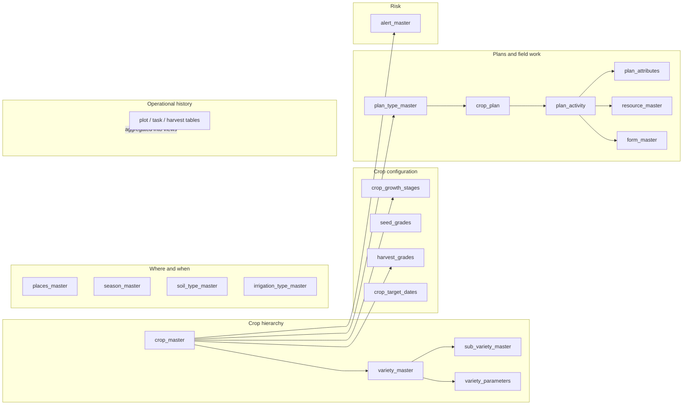
</details>

Two relationships the platform sets up in Configuration and then uses everywhere - and which this graph
inherits:

| Chain | Meaning |
|---|---|
| Client → Contractor → Farmers | who works with whom |
| **Farmer → Asset → Crop → Variety → Sub Variety** | what is grown where, and the crop hierarchy |

The second chain is the one that matters here. The first is out of scope.

**In the demo, the fixture masters are 41 tables** - 19 masters, 11 junctions, 11 operational
aggregates - created by [`supabase/schema.sql`](../supabase/schema.sql) and filled by
`npm run sql:masters`. In a real deployment those tables already exist and only the *mapping file*
changes.

---

## 3. Connecting to it, and why read-only is enforced

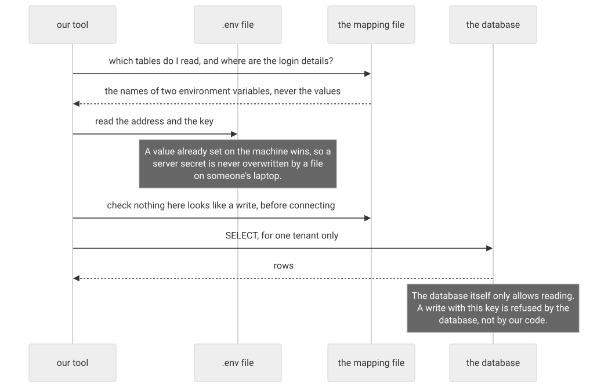

<details>
<summary>Mermaid source</summary>

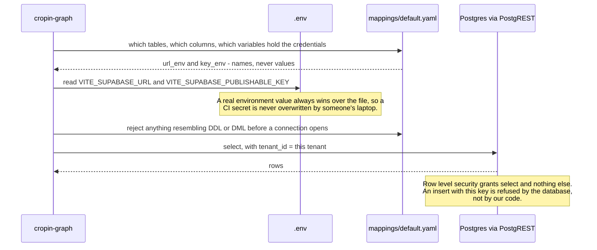
</details>

**Three independent layers say read-only, and they were each verified rather than assumed:**

1. **The mapping file cannot express a write.** It names a table and columns. `assertReadOnly` rejects
   any name matching `insert|update|delete|drop|alter|create|truncate|grant|revoke|copy` *before* a
   connection is opened.
2. **The code only ever issues selects.** `SupabaseTableReader` has one method: `read`.
3. **The database refuses.** `supabase/schema.sql` enables row level security on all 45 tables it
   creates and grants `select` only.

```
$ # insert with the publishable key
  401 {"code":"42501","message":"new row violates row-level security policy for table \"crop_master\""}
```

The one command that writes anything is `push`, and it writes only to the graph store's own `kg_*`
tables - never back to a platform master.

> **Why publishable keys are safe to publish.** The publishable (anon) key is designed to be public; it
> carries no privileges of its own. Everything it can do is decided by row-level security policies in the
> database. The **service role key bypasses RLS entirely** and belongs only in `.env`, which is
> gitignored. `npm run check:secrets` fails the build if a key-shaped string appears in a tracked file.

---

## 4. Pulling the information: what we read and why

We read two kinds of thing.

### Masters, as they are

`crop_master`, `variety_master`, `plan_activity`… straight reads. One query per record type.

### Aggregates, as views

This is the important design decision. **Every derived number is computed by a SQL view, never summed in
our process.**

```sql
-- supabase/schema.sql
create or replace view v_crop_plots as
select v.tenant_id, v.crop_key, sum(coalesce(a.plots, 0))::int as plots
from variety_master v
left join agg_variety_plot_count a
  on a.tenant_id = v.tenant_id and a.variety_key = v.key
group by v.tenant_id, v.crop_key;
```

**Why.** The graph is small - low thousands of nodes. The operational tables are not: plots, tasks and
harvest records run to millions of rows. A relational engine aggregates those far better than anything we
would write, and pulling millions of rows into Node to sum them would be absurd. So SQL aggregates, the
graph is materialised as a document, and traversal happens in memory over a few thousand nodes.

The 31 views split into two jobs:

| Kind | Example | Job |
|---|---|---|
| **weight views** | `v_variety_disease_plots` | turn a junction row into a number: `variety plots × recorded incidence` |
| **display views** | `v_growth_stage_display` | join a foreign key to the label a human reads |

A display view exists because a record's attributes are display-ready strings, and `"Crop": "Potato"`
needs the crop's *name*, not its key. The alternative would be a lookup per row in the mapping layer -
the N+1 the architecture rules out.

### What happens when a table is missing

A table reader returns `null` - not an empty array - when a table does not exist. That distinction is
load-bearing:


<details>
<summary>Mermaid source</summary>

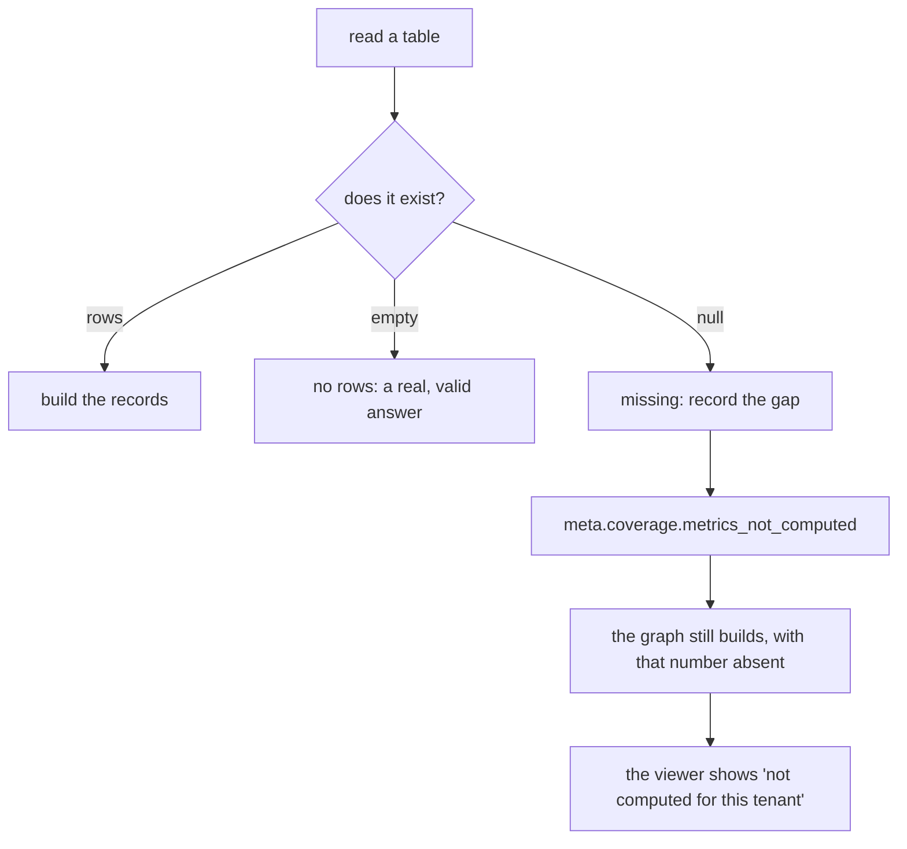
</details>

A tenant with masters but no operational history still gets a usable configuration view - it just has no
weights. That is tested: `tests/fixtures/acme` deliberately omits a metric table.

---

## 5. Mapping: where a row becomes a node

**No table or column name exists anywhere in `src/`.** It all lives in one file per tenant. That is what
makes this portable to a real Cropin schema without touching code.

### The anatomy of a mapping entry

```yaml
records:
  - concept: variety                # which entity type this produces
    from: v_variety_display         # one read - a table or a view
    id: 'variety:{key}'             # stable id, derived from the source key
    label: '{name}'
    note: '{note}'
    attrs:                          # ordered; this IS the display order
      - { key: Variety code,      value: '{code}' }
      - { key: Calibration state, value: '{calibration}' }
    usage:                          # raw numbers, for sorting and bars
      plots:    { from: column, name: plots }
      expected: { from: column, name: expected }
```

### One row, followed all the way through

Here is the actual row for Kufri Pukhraj and what it becomes.


<details>
<summary>Mermaid source</summary>

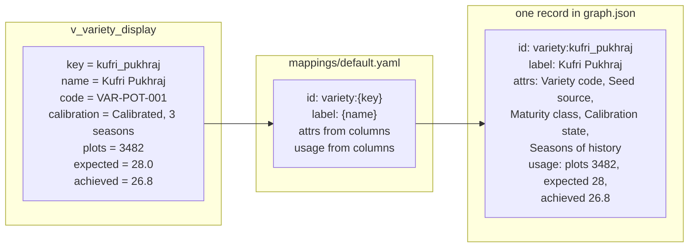
</details>

```bash
npm run graph -- explain dist/demo/graph.json --node variety:kufri_pukhraj
```

### And one row becomes a link, with a weight

```yaml
links:
  - rel: grown in region
    from_table: agg_variety_region        # variety_key, region_key, plots
    from: 'variety:{variety_key}'
    to: 'region:{region_key}'
    weight: { from: column, name: plots }
```

Five rows for Kufri Pukhraj become five weighted links:

| to | plots |
|---|---|
| Gujarat | 1,428 |
| Uttar Pradesh | 1,114 |
| Punjab | 487 |
| West Bengal | 279 |
| Haryana | 174 |
| **sum** | **3,482** — exactly the variety's own plot count |

That sum being exact is not luck; it is [checked on every build](#8-deriving-the-numbers-the-evidence-rule).

### Formatting belongs to the mapping

`attrs` values are display-ready strings, so `{num:gdd} GDD` produces `1,180 GDD`. Formatters: `num`
(Indian digit grouping), `one` (one decimal), `signed` (`+8.6` / `-8.6`), `yesno`, `slug`, `upper`.

**Why here rather than in SQL:** a view should not have to know that this tenant reads numbers in Indian
grouping. Aggregation is a database concern; presentation is a mapping concern.

### Four rules the mapping layer enforces

| Rule | Why |
|---|---|
| One read per record type, link type and metric | N+1 cannot be expressed, so it cannot happen |
| Every read is tenant-scoped unless it explicitly opts out | one build, one tenant, no leakage |
| Reads only | see [§3](#3-connecting-to-it-and-why-read-only-is-enforced) |
| An unresolved slot means the field is omitted | a null column must not ship `"{note}"` as prose |

> That last rule is a real bug that got caught, not a hypothetical. A note mapped from an empty column
> shipped the literal string `{note}` on 198 of 338 records. It was found because the synthetic and
> database paths are required to produce the *same document*, and they differed.

---

## 6. The ontology: what the graph believes exists

Six layers, 23 entity types, 33 relationships. Version-controlled YAML in `ontology/`, identical for
every tenant, because it is **product knowledge, not customer data**.


<details>
<summary>Mermaid source</summary>

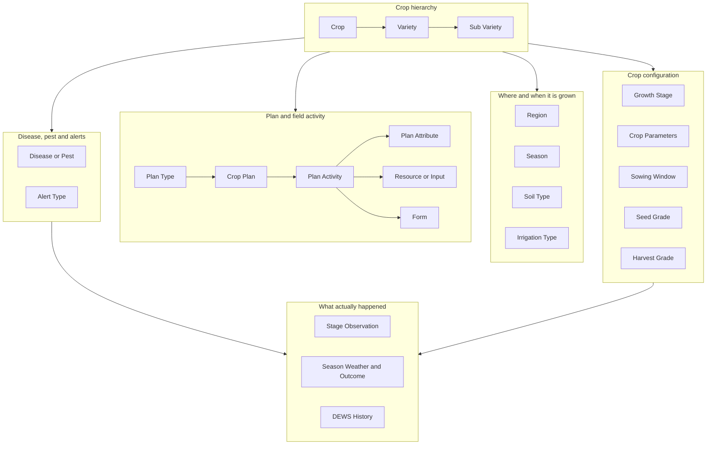
</details>

### Two tiers in one graph

Every node is either a **concept** (an entity type) or a **record** (an actual configured value). Both
are navigable, because a user has two questions at once:

- *What is a harvest grade, and how should I choose one?* → the concept
- *Which harvest grades do we already use for potato, and on how many plots?* → the records

A concept carries a `definition` (what it is) **and** a `decide` (how to choose it — advice, not
description). That second field is why the tool can help someone who has never configured a grade before.

### Relations carry their own display language

```yaml
- key: variety of
  order: 10
  forward: Crop it belongs to        # read from a variety
  reverse: Varieties configured      # read from a crop
  weighted: true
  cardinality: many_to_one
  pairs:
    - { from: variety, to: crop }
```

**Why headings live in the data.** `← applies to Potato` is unreadable. A relation ships a plain-English
heading *per direction*, plus an `order` so panel sections appear in a stable, sensible sequence. An
invariant asserts that a raw relation key can never reach the UI.

**`pairs` is the schema for the schema.** A link whose endpoint concepts are not a declared pair is a
build failure, not a warning. The earlier prototypes had no such constraint and it was the main source of
silent error.

**`weighted` decides whether the plot count applies.** Unweighted relations exist so a total can never be
counted twice through two different paths: a region's plot count sums `grown in region`, and the sowing
windows and observations that also point at that region contribute nothing to it. 191 of 1,149 links in
the demo are unweighted by design, and the viewer says so rather than letting a reader assume a missing
number is a zero.

---

## 7. Building the graph


<details>
<summary>Mermaid source</summary>

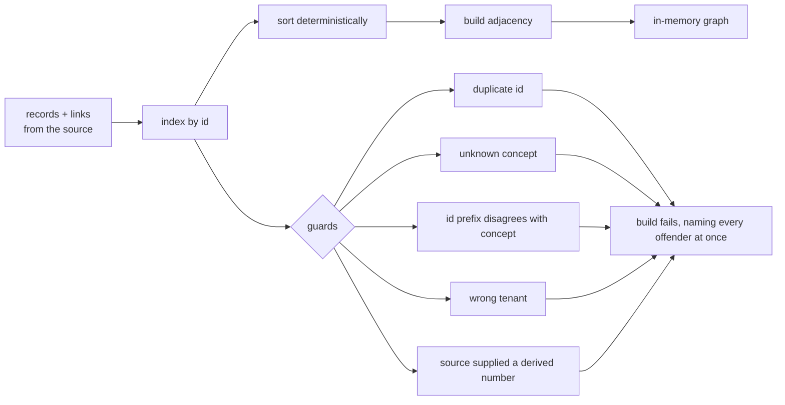
</details>

**IDs are stable across rebuilds.** A record id is `<concept_key>:<snake_key>`, derived from the source
primary key through a documented slug function - never from row order or a display label. That is what
makes `cropin-graph diff` between two rebuilds meaningful.

**Concept membership** (`record.concept`) is an attribute in the document and an edge for traversal. It
keeps 338 membership rows out of `links`, so `meta.counts` means what it says, while leaving every
concept reachable from its own records.

---

## 8. Deriving the numbers: the evidence rule

This is the heart of the project. If you explain one thing, explain this.

> **Exactly one class of number is entered by hand. Every other total is summed from the links at build
> time. Because of that, no two numbers in the graph can contradict each other — and it is tested, not
> asserted.**


<details>
<summary>Mermaid source</summary>

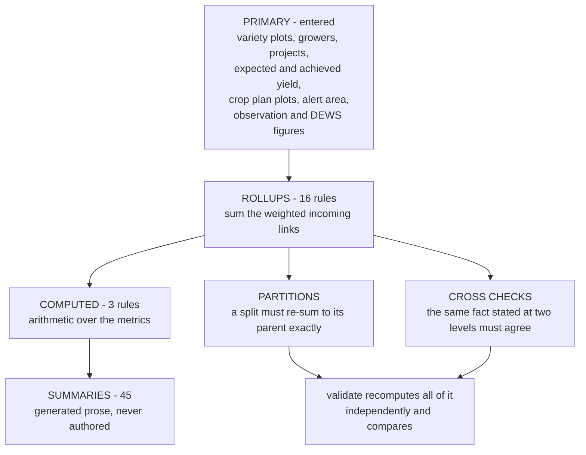
</details>

### Worked example: where Potato's 8,101 plots come from

Nobody typed 8,101. Six variety plot counts were entered; the crop total is their sum:

```
Kufri Pukhraj      3,482
Kufri Jyoti        1,810
Kufri Chipsona-1   1,245
Lady Rosetta         964
Santana              412
Kufri Bahar          188
                  ------
Potato             8,101   ← rollup: sum of incoming "variety of" link weights
```

And Kufri Pukhraj's own 3,482 must partition exactly across every context:

| Split | Values | Sum |
|---|---|---|
| regions | 1,428 + 1,114 + 487 + 279 + 174 | **3,482** |
| seasons | 3,238 Rabi + 244 Spring | **3,482** |
| soil types | alluvial + sandy loam + clay loam | **3,482** |
| irrigation | furrow + sprinkler + drip | **3,482** |
| sub varieties | 2,210 table stock + 1,272 seed stock | **3,482** |

### And a cross-check, because the same fact is stated twice

Late Blight appears at two levels: `Potato → prone to → Late Blight` and `each variety → susceptible →
Late Blight`. Those must agree:

```
Kufri Pukhraj  1,811   (52% of 3,482)
Kufri Jyoti      796
Kufri Chipsona   598
Lady Rosetta     540
Santana          169
              ------
Late Blight    3,914   = the crop-level "prone to" weight, exactly
```

### Why weights do not decay with age

A tempting idea: discount old seasons. **Rejected**, because a decayed weight is a number nobody can
reconstruct, and reconstructability is the entire value of these weights. Two seasons at half weight and
one at full weight read identically, which destroys the distinction the user needs.

What a user actually needs is to know *how much history is behind a number*. So that is stated
directly: every variety carries `Seasons of history` and `Calibration state`, shown beside the gap. A
variety with one season on the base model will read as underperforming whatever the field did — that is
a fact about the model, not the field, and it belongs on screen rather than smeared into a weight.

### One naming honesty

Resource, plan attribute and form roll up a metric called `used_on`, not `plots`. The sets behind those
links overlap — one plot appears under many activities — so summing activity plot counts gives an
*occurrence* count, not a plot count. Calling it `plots` would have been a lie in the same key everything
else tells the truth in. The viewer captions it "Times used".

---

## 9. Proving it: the invariants

Sixteen checks. Each names the offending ids, because a count tells you a build is broken and an id tells
you why. `--strict` is the default, so any failure is a non-zero exit.

| # | Check | What it actually catches |
|---|---|---|
| 1 | No dangling endpoints | a link to an id that does not exist |
| 2 | Every relation is registered | a typo in a mapping's `rel` |
| 3 | Every link matches an allowed concept pair | a variety linked where a crop belongs |
| 4 | Cardinality holds | two crops claiming the same growth stage |
| 5 | No orphan records | a record nothing points at, which no user can reach |
| 6 | ID format and prefix agreement | `crop:potato` filed under Variety |
| 7 | No duplicate labels within a concept (or its `label_scope`) | two records a user cannot tell apart |
| 8 | Rollup, partition and cross-check arithmetic | a total that does not match its parts |
| 9 | Single connected component | an island no navigation can reach |
| 10 | Parity with the reference document | drift: 23 / 338 / 1,149 |
| 11 | Idempotence | non-determinism that would make diffs meaningless |
| 12 | Viewer smoke test in a real browser | a document that renders as nothing |
| 13 | Every relation has both headings and an order | a raw relation key reaching the UI |
| 14 | No tenant leakage | another tenant's row in this document |
| 15 | Attributes declared and in display order | a panel in the wrong order |
| 16 | A re-validated document matches what its own links imply | a hand-edited file |

**8 and 16 do not subsume each other**, and a test pins that down. Check 8 recomputes totals from links
and compares — it proves *internal consistency*, so after a re-derive it passes even if a link weight was
edited, because the total was rebuilt from the edited weight. Check 16 compares against what the
document *claimed*, which is the only place that edit shows up.

**Three invariants were changed by a deliberately-degraded fixture tenant** — the checks were wrong, not
the tenant:

1. Growth stages, grades and diseases are crop-scoped vocabularies. Two crops may both have a stage
   called "Harvest" and that is correct, so uniqueness is scoped by a declared attribute rather than
   renaming everything to "Potato Harvest".
2. A partition over a relation a tenant does not use at all is vacuous, not a contradiction.
3. A concept with no records is a coverage gap, not a graph island.

---

## 10. Publishing: four ways to reach the same document


<details>
<summary>Mermaid source</summary>

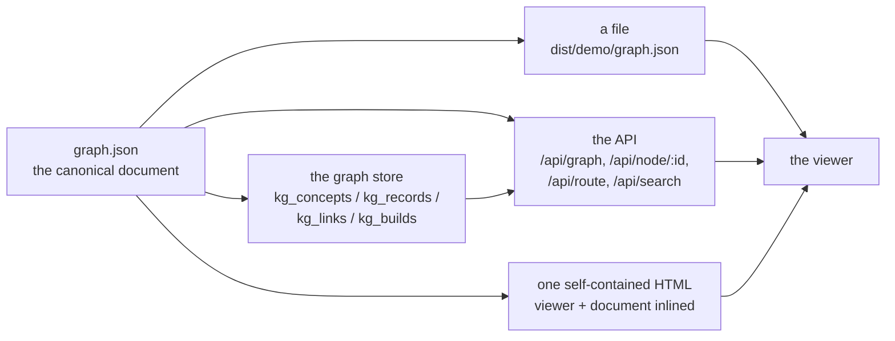
</details>

| Mode | For | Needs |
|---|---|---|
| **file** | local work, CI, diffing two rebuilds | nothing |
| **static site** | the deployed platform | nothing — the viewer reads the document beside it |
| **graph store** | serving many tenants, other consumers | Supabase |
| **single HTML** | handing to someone with no web server | nothing, not even a server |

The store round trip is exact: push then pull returns a **byte-identical** document that passes all 16
invariants.

> That took two fixes. Postgres `jsonb` normalises objects and sorts their keys — so `attrs`, whose
> insertion order *is* the display order, came back reordered on every record. The column is `json` now,
> and pull restores the order from the ontology regardless, because any store that normalises would do
> the same thing.

---

## 11. What a user sees, and what they do with it

### Five views, one question each

| View | The question |
|---|---|
| **Attached** | What is joined directly to this, and how heavily? |
| **Drill down** | What does this lead to? |
| **Where used** | What leads here — what depends on this? |
| **All entity types** | What is in this graph at all? |
| **Route** | How are these two things connected? |

Nothing uses a force simulation. Physics layouts jitter, overlap, and hand you a different picture every
load — useless for something people are meant to read the same way twice. Every position is a function
of the data and the mode.

**Edge thickness is the historical plot count.** A thick link is a proven combination; a thin one is an
experiment. That is read before any label, which is exactly the point.

### The panel order, and why it is that order


<details>
<summary>Mermaid source</summary>

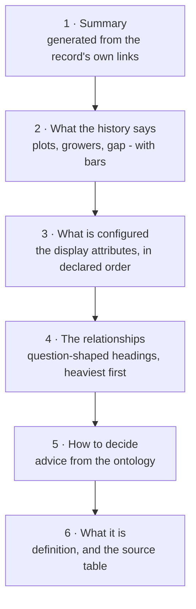
</details>

A user arriving at a record wants the answer, then the evidence, then — only if still unsure — what the
thing is and how to choose it. Putting the definition first would make it a glossary.

### A full session, worked

**Question:** should Lady Rosetta stay on the processing contract in Gujarat?

| Step | What the graph shows | What it means |
|---|---|---|
| 1. Search "Lady Rosetta" | 964 plots, 505 growers, 7 projects | enough history to be worth reading |
| 2. Read the evidence | achieved 27.4 against 32.0 expected, **−14.4%** | a real shortfall |
| 3. Check calibration | "Calibrated, 2 seasons" | so the gap is evidence, not base-model noise |
| 4. Regions it is grown in | Gujarat 675 of 964 plots | the problem is mostly one region |
| 5. Season outcome record | 6 days above 36 °C during tuber bulking; **58% chips grade A** against an 80% expectation | the yield gap and the grade failure are *one event* |
| 6. Stage observation | Gujarat tuber bulking ran **32 days** against 35 configured (−9%); the same stage ran **38 days** in Uttar Pradesh (+9%) | one national stage set cannot serve both regions |
| 7. Sub variety | LR Processing Lot promises "80 percent chips grade A" | the promise was never revised after season one |

**Three configuration changes fall out of that, and they are different changes:**

1. **Revise the grade expectation** on the sub variety — separately from the yield expectation on the
   variety. They failed together but they are not the same promise.
2. **Give Gujarat its own stage durations.** Activities anchored to the end of bulking currently fire
   after the crop has finished bulking there, and early in Uttar Pradesh, from one configuration.
3. **Configure a sowing window** for potato × Gujarat × Rabi, so a late sowing date is caught at entry
   instead of propagating silently into stage, progression, harvest window and yield.

Then the loop closes: the next rebuild reads those changes back, and the weights move. **The graph never
writes to a master. It shows; a person decides.**

---

## 12. The questions people will ask

**Why not a graph database?**
The graph is small — low thousands of nodes, low tens of thousands of links per tenant. The hard work is
aggregation over large operational tables, which a relational engine does far better. A graph database
would buy nothing at this size and cost a dependency, an operational surface and a second query language.
Revisit above roughly 100k nodes for one tenant.

**Why not just a BI dashboard or a SQL report?**
A report answers a question you already knew to ask. The value here is *adjacency*: standing on Lady
Rosetta and seeing, in one place, the regions, the stage deviations, the weather outcome and the grade
promise — without knowing in advance that those four things were related. A dashboard would need a tile
per question; the graph needs one screen.

**Is this a new source of truth?**
No, and deliberately so. It is a derived artefact, rebuildable from scratch at any time. Delete it and
nothing is lost. `meta.source_snapshot` says how fresh the underlying data is and `meta.built_at` says
when the document was made; both are on screen.

**What if the underlying data is wrong?**
Then the graph is wrong in the same way, and says so louder. It cannot invent consistency — but it does
make inconsistency visible: 191 links carry no historical count and are shown as such, missing metrics
appear in `meta.coverage`, and a variety on the base model is labelled as such next to its gap.

**How is this different from the platform's own reports?**
Those are organised around *this season's operations* — projects, tasks, plots. This is organised around
*a configuration decision*, and it carries the ontology's advice on how to make it. Different axis,
different question.

**How do we add a new entity type?**
Add it to `ontology/concepts.yaml` with its definition, `decide` advice, attribute order and source
table; add the relations that reach it to `relations.yaml` with both headings and valid pairs; add a
mapping entry. The ontology self-validates at import, so a mistake is a crash at startup rather than a
wrong number later.

**How do we onboard a new tenant?**
Copy `mappings/default.yaml`, point it at that tenant's tables, run one command. Nothing in `src/`
changes. If their schema differs, only the mapping does.

**How long does a rebuild take?**
Under a second for the reference tenant end to end, including all 16 invariants. Scheduled rebuild is
explicitly sufficient; there is no streaming and no need for it.

**Can one tenant see another's data?**
Every record and link carries `tenant_id`, a build runs for exactly one tenant, and invariant 14 asserts
no other tenant's rows appear. Cross-tenant benchmarking is deliberately **not built**; when it is, it
belongs behind an explicit flag with a k-anonymity floor of 5+ tenants and 50+ plots, in place from the
first line of code.

**What is real and what is synthetic?**
The ontology is real product knowledge, traced term by term to the platform walkthrough. **Every record
value in the demo tenant is invented** — realistic in shape, internally consistent, 6 crops and 22
varieties and 25,761 plots that all reconcile, but nothing came from a real tenant.

**What is the biggest integration risk?**
Three of the six `observed` concepts — Stage Observation, Season Weather and Outcome, DEWS History — are
aggregations the platform *can compute* but does not expose as objects today. Each needs a query written
against operational tables. `ontology/nomenclature.md` names them rather than burying them, because
that is where the real work is.

**What would phase 2 be?**
A write path: configuring *through* the graph, proposing changes back to the masters. Nothing is
architected against it — the mapping layer already declares which platform field each graph value came
from, which is exactly what a write path needs.

**What are the honest limits?**
Six crops and 22 varieties is enough to prove the model and nowhere near a real catalogue. Cost figures
are indicative. Stage-set overrides are *identified* by the observed layer but not modelled. And the
graph shows correlation with plot counts behind it — it does not establish causation.

---

## 13. Cheat sheet

**The one-sentence version.** A read-only knowledge graph over the Cropin masters that answers *what
should I configure, and what does our own history say about that choice* — where every number except a
variety's plot count is summed from the links, so no two figures on screen can disagree.

**Numbers worth knowing**

| | |
|---|---|
| Entity types / relationships / layers | 23 / 33 / 6 |
| Reference tenant | 338 records, 1,149 links, 25,761 plots |
| Crops / varieties / sub varieties | 6 / 22 / 17 |
| Derivation rules | 16 rollups, 3 computed, 45 generated summaries |
| Invariants | 16 (13 in-document, plus idempotence, browser smoke, re-validation) |
| Graph shape | 1 component, longest path 7, mean 3.3 |
| Unweighted links, by design | 191 of 1,149 |
| Fixture database | 41 tables, 31 views |
| Tests | 90 |

**Commands worth remembering**

```bash
npm run build:demo          # build the reference tenant, no database needed
npm run build:supabase      # build from the database through the mapping file
npm run build:static        # what a deployment publishes
npm run check               # secrets, types, tests
npm run graph -- explain dist/demo/graph.json --node variety:lady_rosetta
npm run graph -- diff dist/demo/graph.json dist/demo/graph.prev.json
```

**The three sentences that carry the design**

1. *Only variety plot counts are entered; every other total is summed from the links and then recomputed
   independently and compared.*
2. *The ontology is global product knowledge; records and links are per tenant.*
3. *It is read-only and derived — it shows, a person decides, and the next rebuild reads the change back.*

---

**Related reading:** [`README.md`](../README.md) for the two sequence diagrams and the commands,
[`ARCHITECTURE.md`](ARCHITECTURE.md) for the pipeline in detail, [`DECISIONS.md`](DECISIONS.md) for the
eight open questions this build settled, [`DOMAIN.md`](DOMAIN.md) for the platform itself, and
[`../ontology/nomenclature.md`](../ontology/nomenclature.md) for every term traced to its source.
