# How it works

A plain-English walkthrough of the whole project, one step at a time. No prior knowledge needed.

Read this and you should be able to explain the project to anyone — what it is, how the data gets in, why
each choice was made, and what someone actually does with it.

Every number here is real. It comes from the built graph, not from an example I made up. Where you can
check a number yourself, the command is right under it.

> Want the technical version instead? [`ARCHITECTURE.md`](ARCHITECTURE.md) has the pipeline in depth and
> [`DECISIONS.md`](DECISIONS.md) has the reasoning behind the harder calls. This document is the friendly
> one.

The pictures are generated from the mermaid code tucked under each one. `npm run docs:diagrams` rebuilds
them.

---

## Contents

- [The short version](#the-short-version)
- [Step 1 — We start with a database full of Cropin data](#step-1--we-start-with-a-database-full-of-cropin-data)
- [Step 2 — We connect to it, and we can only read](#step-2--we-connect-to-it-and-we-can-only-read)
- [Step 3 — We read two kinds of thing](#step-3--we-read-two-kinds-of-thing)
- [Step 4 — We turn rows into things and connections](#step-4--we-turn-rows-into-things-and-connections)
- [Step 5 — We tell the graph what each thing *is*](#step-5--we-tell-the-graph-what-each-thing-is)
- [Step 6 — We assemble the graph](#step-6--we-assemble-the-graph)
- [Step 7 — We work out all the numbers](#step-7--we-work-out-all-the-numbers)
- [Step 8 — We check that everything adds up](#step-8--we-check-that-everything-adds-up)
- [Step 9 — We publish it](#step-9--we-publish-it)
- [Step 10 — Someone uses it](#step-10--someone-uses-it)
- [How to use Route](#how-to-use-route)
- [Questions people ask](#questions-people-ask)
- [Cheat sheet](#cheat-sheet)

---

## The short version

**The problem.** Someone is setting up next season in Cropin Cloud. For a potato contract in Gujarat they
have to pick a variety, a set of growth stages, a yield to expect, a grade to promise the buyer, and which
diseases to watch for.

The platform will accept whatever they type. It already holds the history that would tell them which
answers worked last time — plot counts, harvest results, stage timings, weather, disease warnings. But
that history sits across projects, reports and dashboards, and all of those are built around *running
this season*, not around *making this choice*.

So the choice gets made from memory. Two seasons later the yield came in 14% low and the grade failed, and
nobody can say whether the cause was the variety, the region, the stage set, or the weather.

**What we built.** One screen that answers the setup question using the organisation's own history.

- Pick any thing — a crop, a variety, a plan, a disease.
- See everything connected to it, and **how many real plots are behind each connection**.
- See what actually happened on those plots, right next to what was set up.

**What it does not do.** It never changes anything in Cropin. It only reads. It shows the evidence; a
person makes the decision.

**One idea to remember.** Almost every number on the screen is *added up from the connections*, not typed
in by anyone. That is why two numbers on the graph can never disagree.
[Step 7](#step-7--we-work-out-all-the-numbers) explains it.

---

## Step 1 — We start with a database full of Cropin data

A Cropin tenant has tables for everything you set up: crops, varieties, growth stages, plans, activities,
alerts. These are **master tables** — the reference lists that the rest of the system points at.

We named our tables after the ones in the Cropin walkthrough and traced every term back to it in
[`ontology/nomenclature.md`](../ontology/nomenclature.md), so none of the vocabulary here is invented.


<details>
<summary>Mermaid source</summary>

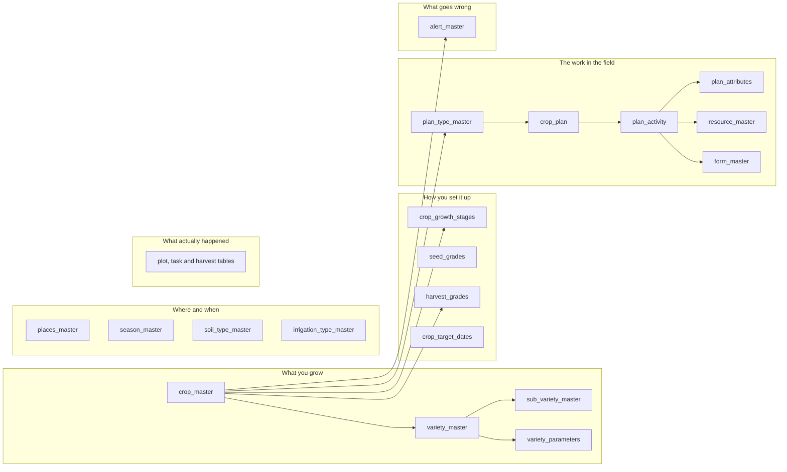

</details>

Cropin sets up two chains and then uses them everywhere:

| Chain | What it means |
|---|---|
| Client → Contractor → Farmers | who works with whom |
| **Farmer → Asset → Crop → Variety → Sub Variety** | what is grown, and how crops are organised |

**The second chain is the one this project cares about.** The first is about people, and people are out of
scope on purpose.

For the demo we created those tables ourselves and filled them with made-up but realistic data — 41
tables in all. In a real deployment they already exist, and the only thing that changes is one
configuration file, which you meet in [Step 4](#step-4--we-turn-rows-into-things-and-connections).

---

## Step 2 — We connect to it, and we can only read


<details>
<summary>Mermaid source</summary>

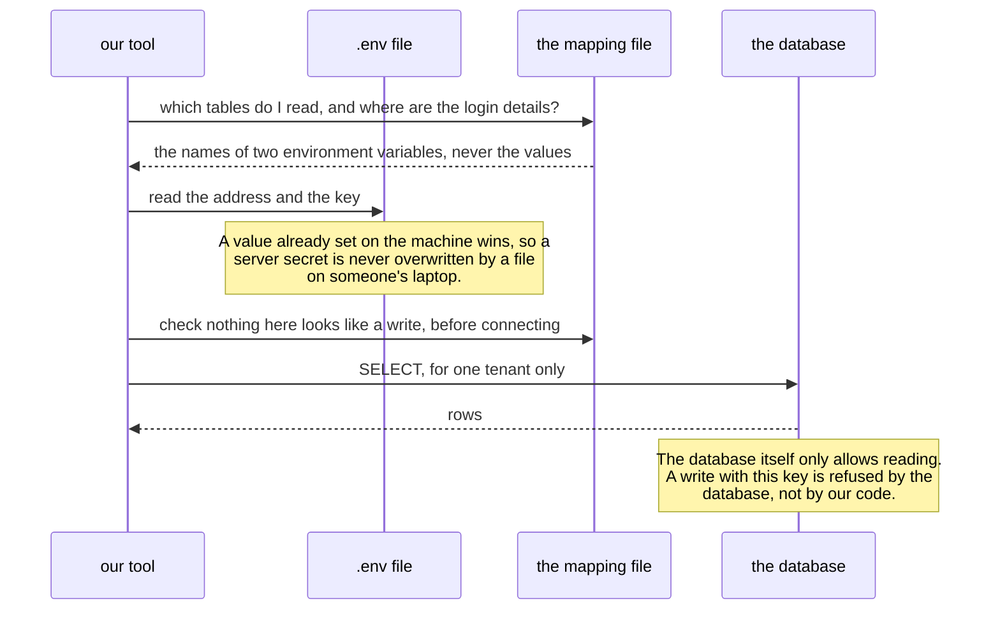

</details>

Three separate things stop this project from ever changing your data. Any one would be enough; having all
three means a mistake in one is caught by the others.

1. **The configuration file cannot even describe a write.** It only lists table and column names. Before
   we open a connection we scan it for anything that looks like a change — `insert`, `update`, `delete`,
   `drop` and so on — and refuse to continue if we find one.
2. **The code has no way to write.** The piece that talks to the database has exactly one function:
   `read`.
3. **The database says no.** We switch on a Postgres feature called row level security and grant only
   `SELECT`. So even if the first two failed, the database refuses.

We tested that third one rather than assuming it:

```
$ # try to insert a row using the key this project uses
  401  new row violates row-level security policy for table "crop_master"
```

**About the two kinds of key.** Supabase gives you a *publishable* key and a *secret* key.

- The **publishable key** is meant to be public. On its own it can do nothing — what it reaches is decided
  entirely by the database's security rules, and ours allow reading only. This is the key the project
  uses.
- The **secret key** ignores all those rules. It belongs only in `.env`, which is never committed. Just
  one command needs it, and that command writes to our own tables — never to a Cropin table.

`npm run check:secrets` fails the build if a key-shaped string ever appears in a committed file.

---

## Step 3 — We read two kinds of thing

### Kind one: the lists, as they are

`crop_master`, `variety_master`, `plan_activity` and the rest. Plain reads, one query per kind of thing.

### Kind two: the counts, worked out by the database

This is the most important technical decision in the project, and it is simple once you see why.

We need numbers like *how many plots grow this variety*. Those come from the operational tables — plots,
tasks, harvests — which can hold millions of rows. So we do **not** pull those rows out and count them
ourselves. We ask the database to count them, using a **view**: a saved query that behaves like a table.

```sql
-- how many plots each crop has: add up its varieties
create or replace view v_crop_plots as
select v.tenant_id, v.crop_key, sum(coalesce(a.plots, 0))::int as plots
from variety_master v
left join agg_variety_plot_count a
  on a.tenant_id = v.tenant_id and a.variety_key = v.key
group by v.tenant_id, v.crop_key;
```

**Why this way?** The graph is small — a few thousand things. The operational tables are huge. Databases
are extremely good at counting millions of rows; dragging those rows across the network to count them in
our own program would be slow and pointless. So the database counts, and we read the answer.

We have 31 of these views doing two jobs:

| Job | Example | What it does |
|---|---|---|
| **Work out a number** | `v_variety_disease_plots` | a variety's plots × how often the disease was recorded |
| **Fetch a name** | `v_growth_stage_display` | a stage row stores `crop_key`; a person needs to read "Potato" |

The second kind exists because the screen shows names, not database keys. Looking up each name one row at
a time would mean thousands of tiny queries, so the database joins them once instead.

### What if a table is missing?

Not every customer has every table. Maybe their crops and varieties are set up but there is no harvest
history yet. We handle that on purpose:


<details>
<summary>Mermaid source</summary>

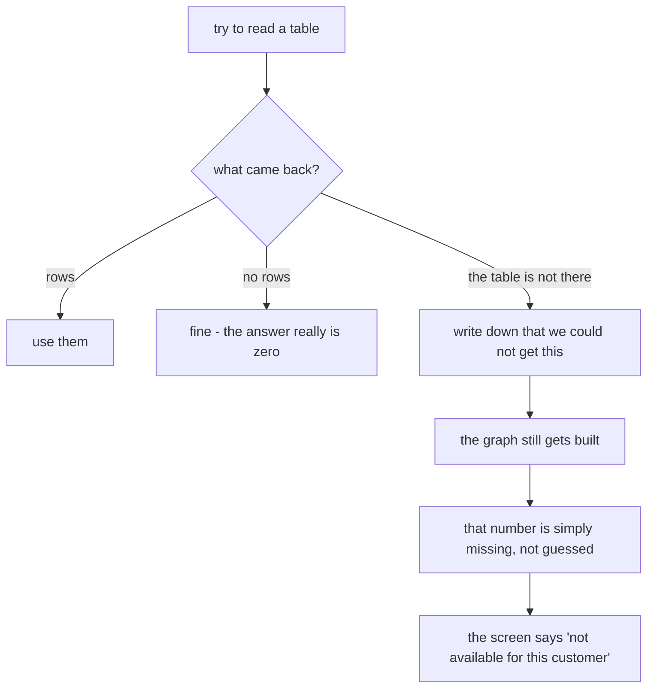

</details>

The key point: **missing and empty are different**, and we never turn a missing number into a zero. A
customer with no history still gets a useful setup view — it just has no plot counts behind the
connections, and the screen says so.

---

## Step 4 — We turn rows into things and connections

A graph is made of two ingredients:

- **things** — Kufri Pukhraj, Gujarat, Late Blight
- **connections** — Kufri Pukhraj *is grown in* Gujarat

So how do we know that the `name` column becomes the title and the `plots` column becomes a count? That is
written down in one file per customer: the **mapping file**.

**No table name or column name appears anywhere in our program code.** It all lives in that file. That is
what lets this work against a real Cropin database without changing any code.

### What a mapping entry looks like

```yaml
records:
  - concept: variety              # what kind of thing this makes
    from: v_variety_display       # which table or view to read
    id: 'variety:{key}'           # its permanent id
    label: '{name}'               # what a person sees
    attrs:                        # the details, in the order they appear on screen
      - { key: Variety code,      value: '{code}' }
      - { key: Calibration state, value: '{calibration}' }
    usage:                        # the numbers, used for sorting and bars
      plots:    { from: column, name: plots }
      expected: { from: column, name: expected }
```

Anything in curly braces is a column name. `{name}` means "put the `name` column here".

### One row, followed all the way through


<details>
<summary>Mermaid source</summary>

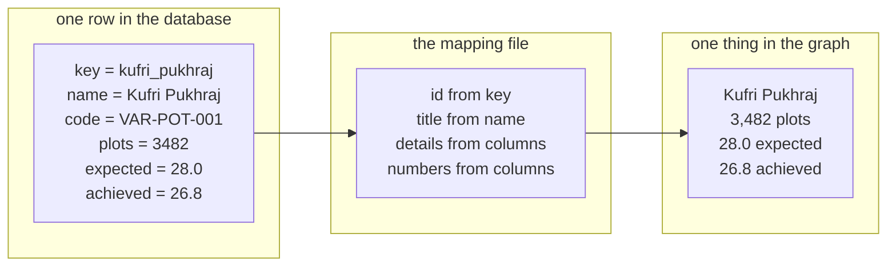

</details>

You can print exactly what came out:

```bash
npm run graph -- explain dist/demo/graph.json --node variety:kufri_pukhraj
```

### And a row becomes a connection, with a count on it

```yaml
links:
  - rel: grown in region                # the kind of connection
    from_table: agg_variety_region      # a table of variety, region, plots
    from: 'variety:{variety_key}'
    to: 'region:{region_key}'
    weight: { from: column, name: plots }   # the number that rides along on it
```

Five rows about Kufri Pukhraj become five connections, each carrying a plot count:

| connected to | plots |
|---|---|
| Gujarat | 1,428 |
| Uttar Pradesh | 1,114 |
| Punjab | 487 |
| West Bengal | 279 |
| Haryana | 174 |
| **total** | **3,482** — exactly the variety's own plot count |

That total matching is not a coincidence. It is checked on every build, in
[Step 8](#step-8--we-check-that-everything-adds-up).

### Making numbers look right

Screen text is prepared in the mapping file, not in the database. `{num:gdd} GDD` turns `1180` into
`1,180 GDD`. There are a handful of these helpers: `num` (adds commas), `one` (one decimal place),
`signed` (adds a `+` or `−`), `yesno`, and a couple more.

Why here and not in the database? Because a database view should not have to know that this particular
customer likes commas in a particular place. Counting is the database's job; formatting is the mapping
file's job.

### Four rules the mapping file must follow

| Rule | Why |
|---|---|
| One read per kind of thing | You cannot accidentally write something that fires a query per row |
| Always filter to one customer | One build, one customer, no mixing |
| Reading only | See [Step 2](#step-2--we-connect-to-it-and-we-can-only-read) |
| If a value is missing, leave the field out | Never show a placeholder as though it were real text |

> That last rule came from a real bug. A note pulled from an empty column was printing the literal text
> `{note}` on 198 of 338 things. We found it because the two ways of building the graph — from our made-up
> data and from the database — have to produce *identical* results, and they did not match.

---

## Step 5 — We tell the graph what each thing *is*

The mapping file says where data comes from. Something else has to say what it *means*. That is the
**ontology** — a grand word for a small set of files describing the vocabulary.

It is the same for every customer, because it describes how Cropin works, not what one customer has set
up. It lives in `ontology/` as plain text files you can read and edit.


<details>
<summary>Mermaid source</summary>

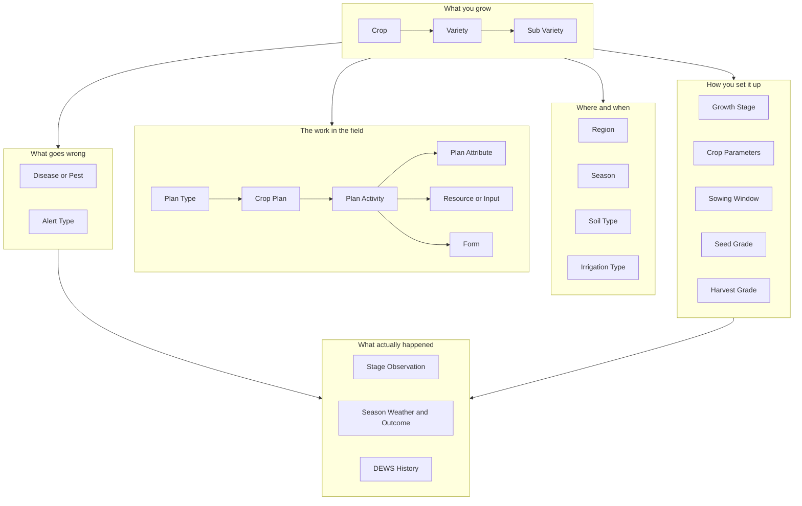

</details>

**23 kinds of thing, in 6 groups, joined by 33 kinds of connection.**

### Two levels in one graph

Everything on the graph is one of two levels:

- a **kind of thing** — "Variety", "Harvest Grade"
- an **actual thing** — "Kufri Pukhraj", "Chips Grade A"

You can click either, because people have both questions at once:

- *What is a harvest grade, and how do I choose one?* → the kind
- *Which harvest grades do we already use for potato, and on how many plots?* → the actual ones

Each kind of thing carries two pieces of writing: **what it is**, and **how to choose it**. The second is
advice, not a definition. It is what lets the screen help somebody who has never set up a harvest grade
before.

### Connections carry their own wording

Here is one connection type, exactly as written down:

```yaml
- key: variety of
  order: 10
  forward: Crop it belongs to        # heading when you're looking at a variety
  reverse: Varieties configured      # heading when you're looking at a crop
  weighted: true                     # does a plot count ride on this connection?
  pairs:
    - { from: variety, to: crop }    # what may be joined to what
```

Three things worth noticing.

**Every connection has two headings, one per direction.** Reading `← applies to Potato` on a screen is
horrible. So a connection stores real English for both directions. On a variety the section is headed
*"Crop it belongs to"*. On the crop, the same connection reads *"Varieties configured"*.

**`pairs` says what is allowed to connect to what.** If data tries to join a variety where a crop belongs,
the build stops. An earlier prototype had no such rule and that was its biggest source of quiet mistakes.

**`weighted` says whether a plot count belongs on this connection.** Some connections are just statements
of fact with no count behind them — 191 of our 1,149 are like this, on purpose. The screen shows them as
having no number rather than a zero, because "we don't count this" and "this is zero" mean very different
things.

---

## Step 6 — We assemble the graph


<details>
<summary>Mermaid source</summary>

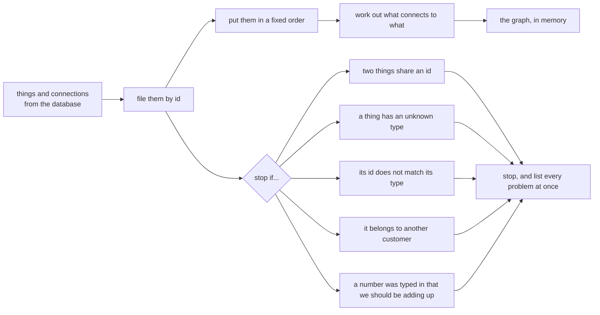

</details>

Two details worth knowing.

**Ids never change between builds.** An id looks like `variety:kufri_pukhraj` — the kind of thing, then a
tidied-up version of its key from the database. It is never based on row order or on the display name.
That is what makes it possible to compare two builds and see what genuinely changed:

```bash
npm run graph -- diff dist/demo/graph.json dist/demo/graph.prev.json
```

**When something is wrong, we list everything.** The build does not stop at the first problem and make you
run it again five times. It collects them all and prints them together, each naming the exact thing at
fault.

---

## Step 7 — We work out all the numbers

This is the heart of the project. If you only explain one thing, explain this.

> **Only one kind of number is typed in by a person. Every other number is added up from the connections.
> That is why no two numbers on the graph can disagree — and we test it rather than claiming it.**


<details>
<summary>Mermaid source</summary>

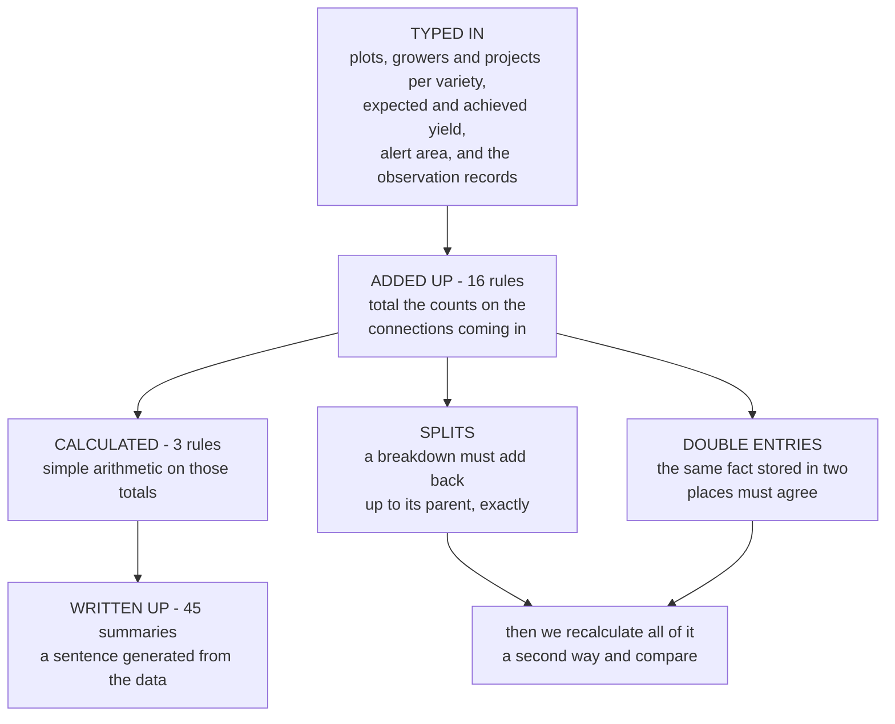

</details>

### Where Potato's 8,101 plots come from

Nobody typed 8,101. Six variety counts were typed in. The crop total is their sum:

```
Kufri Pukhraj      3,482
Kufri Jyoti        1,810
Kufri Chipsona-1   1,245
Lady Rosetta         964
Santana              412
Kufri Bahar          188
                  ------
Potato             8,101      added up from the connections
```

### And Kufri Pukhraj's 3,482 has to split perfectly, every way you cut it

| Broken down by | The pieces | Adds up to |
|---|---|---|
| region | 1,428 + 1,114 + 487 + 279 + 174 | **3,482** |
| season | 3,238 Rabi + 244 Spring | **3,482** |
| soil type | alluvial + sandy loam + clay loam | **3,482** |
| irrigation | furrow + sprinkler + drip | **3,482** |
| sub variety | 2,210 table stock + 1,272 seed stock | **3,482** |

### And where the same fact is stored twice, both copies must match

Late Blight appears in two places: on the crop ("Potato is prone to Late Blight") and on each variety
("this variety had Late Blight recorded"). Those have to agree:

```
Kufri Pukhraj  1,811      (52% of its 3,482 plots)
Kufri Jyoti      796
Kufri Chipsona   598
Lady Rosetta     540
Santana          169
              ------
Late Blight    3,914      and the crop-level number is also 3,914
```

### Why we don't make old seasons count for less

It sounds sensible: give last season more weight than one from four years ago. **We decided not to**, for
one reason. A discounted number is a number nobody can reconstruct. Two old seasons at half weight and one
recent season at full weight would look identical on screen, which hides exactly the thing you need to
know.

What people actually need is to know *how much history is behind a number*. So we say it outright. Every
variety shows **how many seasons of history** it has and whether the models are **calibrated** for it. A
variety with one season sits on a generic model and will look like it is underperforming no matter what
the field did — that is a fact about the model, not the crop, and it belongs on the screen in words.

### One small piece of honesty about a name

Three kinds of thing — resources, captured fields and forms — show a number called **"Times used"** rather
than "Plots". Here is why. One plot involves many activities, so adding up the plot counts of those
activities counts the same plot several times over. It is a real measure of how widely something is
reused, but it is not a plot count, so we don't call it one.

---

## Step 8 — We check that everything adds up

Sixteen checks run on every build. Each names the exact things at fault, because "3 errors" tells you the
build is broken and "these three ids" tells you why. In the code these are called *invariants* — things
that must always be true.

| # | The check | A real thing it catches |
|---|---|---|
| 1 | Every connection points at something that exists | a connection to a deleted thing |
| 2 | Every connection is a known type | a typo in the mapping file |
| 3 | Only allowed pairs are connected | a variety joined where a crop belongs |
| 4 | One-to-many rules are respected | two crops claiming the same growth stage |
| 5 | Nothing is stranded | a thing with no connections, which nobody could ever find |
| 6 | Ids match their type | `crop:potato` filed under Variety |
| 7 | No two things share a name | two records a person cannot tell apart |
| 8 | All the arithmetic | a total that doesn't match its parts |
| 9 | Everything is reachable | an island cut off from the rest |
| 10 | Nothing drifted since last time | we expect 23 kinds, 338 things, 1,149 connections |
| 11 | Building twice gives the same file | randomness that would make comparisons useless |
| 12 | It actually renders in a browser | a file that draws as nothing |
| 13 | Every connection has real English headings | a raw code name leaking onto the screen |
| 14 | No other customer's data is present | the worst possible bug |
| 15 | Details are in the right order | a panel showing fields jumbled |
| 16 | A saved file still matches its own connections | somebody hand-edited the output |

**Checks 8 and 16 sound the same but are not**, and there is a test that proves it. Check 8 recalculates
the totals from the connections and compares, so it proves the file is *self-consistent*. If somebody
edited a connection's count, check 8 would recalculate from the edited number and be perfectly happy.
Check 16 compares against what the file *claimed* earlier, which is the only place that edit shows up.

**Three of these checks were wrong, and a deliberately broken test customer proved it.** We fixed the
checks, not the data:

1. Two crops can both have a stage called "Harvest". That is correct, not a clash — so names only need to
   be unique *within a crop*. The alternative was renaming everything to "Potato Harvest", which reads
   badly in the place the name is actually used.
2. If a customer doesn't use irrigation types at all, "the irrigation breakdown must add up" has nothing
   to check. That is not a failure.
3. A kind of thing with nothing set up against it is a gap to report, not a broken graph.

---

## Step 9 — We publish it

Everything above produces **one file**: `graph.json`. That file is the whole graph. There are four ways to
get it in front of someone.


<details>
<summary>Mermaid source</summary>

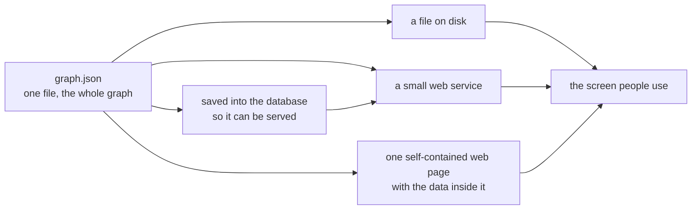

</details>

| Way | Good for | What it needs |
|---|---|---|
| **a file** | working locally, comparing two builds | nothing |
| **a website** | the deployed tool | nothing — the page reads the file next to it |
| **saved in the database** | serving several customers, other systems | Supabase |
| **one web page** | emailing to someone | nothing at all, not even a server |

That last one is genuinely one file. Double-click it with no internet and no server and the whole thing
works.

> Saving into the database and reading it back gives you a **byte-for-byte identical** file. Getting there
> needed a fix. Postgres has a storage type that quietly re-sorts the fields inside a record, which
> scrambled the order of the details on screen. We switched to the type that keeps the order, and we also
> re-apply the correct order when reading, so any future storage that reshuffles cannot break it.

---

## Step 10 — Someone uses it

### Five ways to look, one question each

| View | The question it answers |
|---|---|
| **Attached** | What is directly connected to this, and how strongly? |
| **Drill down** | What does this lead to? |
| **Where used** | What depends on this? |
| **All entity types** | What is in here at all? |
| **Route** | How are these two things connected? |

**Thick lines mean more plots.** A thick connection is something the organisation has done many times; a
thin one is an experiment. You read that before you read any words, which is the point.

**Nothing bounces around.** Many graph tools use a physics simulation, so the picture is different every
time you open it and labels overlap. Ours puts every item in a calculated position, so the same thing is
always in the same place and no two labels ever collide.

### The order of the side panel, and why it is that order


<details>
<summary>Mermaid source</summary>

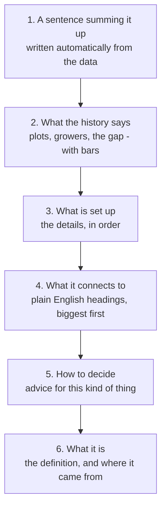

</details>

Someone opening a variety wants the answer first, then the evidence, then — only if still unsure — what
the thing is and how to choose it. Putting the definition first would turn a decision tool into a
dictionary.

### A real session, start to finish

**The question: should Lady Rosetta stay on the processing contract in Gujarat?**

| What they do | What the screen shows | What it means |
|---|---|---|
| 1. Search "Lady Rosetta" | 964 plots, 505 growers, 7 projects | enough history to be worth trusting |
| 2. Read the numbers | got 27.4 against 32.0 expected — **14.4% short** | a real shortfall |
| 3. Check the history | "Calibrated, 2 seasons" | this is evidence, not a generic model guessing |
| 4. Look at regions | Gujarat: 675 of the 964 plots | the problem is mostly in one place |
| 5. Open the season record | 6 days above 36 °C during bulking; **58% top grade** against 80% promised | the low yield and the failed grade are **one event**, not two problems |
| 6. Open the stage record | in Gujarat that stage ran **32 days**, not the 35 set up. In Uttar Pradesh it ran **38** | one national setup cannot fit both regions |
| 7. Check the promise | the lot promises "80 percent chips grade A" | never revised after the first season |

**Three different fixes come out of that:**

1. **Change the grade promise** — separately from the yield expectation. They failed together, but they
   are two different promises to two different people.
2. **Give Gujarat its own stage lengths.** Right now, work scheduled for the end of that stage happens
   *after* the crop has finished it in Gujarat, and too early in Uttar Pradesh, from the same setup.
3. **Set a sowing window** for potato in Gujarat in Rabi, so a late sowing date gets caught as it is typed
   in, instead of quietly throwing off every prediction that counts from it.

Then the loop closes. Someone makes those changes in Cropin, the next build reads them back, and the
numbers move. **The graph never writes anything. It shows; a person decides.**

---

## How to use Route

The other four views start from one thing. Route starts from **two**, and shows the chain between them
with the relationship written on every step. It answers a question you can't easily ask a report, because
to write the report you would have to already know the answer.


<details>
<summary>Mermaid source</summary>

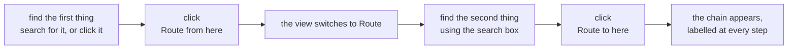

</details>

### On screen

Two ways to pick the ends:

- **Using the panel.** Open anything and click **Route from here**. Then search for the second thing and
  click **Route to here**. This always works, because search finds everything.
- **Clicking the picture.** While you are in Route view, your first click sets the start, the second sets
  the end, and a third starts over. Quicker when both are already visible.

The left-hand side shows both ends with an `×` to clear either. Until you have picked both, Route just
shows the normal Attached view of whichever end you have — so you can keep exploring while you decide.

### On the command line

```bash
npm run graph -- route dist/demo/graph.json \
  --from region:gujarat --to form:harvest_and_grading
```

```
Gujarat
  |  Varieties grown here (361 plots)
Kufri Chipsona-1
  |  Crop plans attached (1,245 plots)
Chipsona Processing Rabi
  |  Activities in this plan (1,245 plots)
Grading and Sorting
  |  Form it is recorded on (3,261 plots)
Harvest and Grading
```

Read it as a sentence: *Gujarat grows Kufri Chipsona-1, which uses the Chipsona Processing Rabi plan,
which includes Grading and Sorting, which is recorded on the Harvest and Grading form.* That is how a
region connects to a form — four steps, and nobody had to know any of them in advance.

### Four things about how it behaves

| What it does | Why |
|---|---|
| **It walks connections in either direction** | We store "variety → prone to → disease" that way round because that is how the sentence reads. But you might want to walk it backwards, so Route does. |
| **Headings flip to match the direction** | In the example above it says *"Varieties grown here"* — the *reverse* wording of "grown in region". Go the other way and the same connection reads *"Regions it is grown in"*. This is exactly why every connection stores two headings. |
| **The same two ends always give the same path** | So a route is safe to screenshot, paste into a document, or use in a test. |
| **Dashed steps mean "is a kind of"** | Sometimes the only way between two things is up to their type and back down. Those steps are dashed and carry no count, because being the same kind of thing is not evidence. |

### Three routes worth trying

| Question | Try | What you find |
|---|---|---|
| Does this risk have anything set up to deal with it? | `disease_or_pest:stem_borer_rice` → `plan_activity:pheromone_trap_install` | **One step, 633 plots.** The treatment exists… then open that activity and it is in **no paddy plan at all**. A risk with nothing set up to answer it. |
| Why does this grade apply to this variety? | `variety:lady_rosetta` → `harvest_grade:chips_grade_a` | **Two steps.** It isn't attached to the variety — it reaches it via Potato, because grades are set up on the crop and used on the variety. |
| How does an input trace back to a crop? | `crop:potato` → `resource_or_input:cold_store_space` | **Five steps**, through an alert, an activity, and the plan containing it. |

> **A surprisingly long route is often the finding.** If two things you thought were closely tied turn out
> to be four steps apart through something unrelated, that distance *is* the setup problem.

---

## Questions people ask

**Why not use a graph database?**
The graph is small — a few thousand items. The heavy work is counting rows in huge operational tables,
which a normal database does better than a graph one. A graph database would add a dependency, another
thing to run and another query language, for no gain. Worth revisiting if one customer ever passes about
100,000 items.

**Why not just build a dashboard?**
A dashboard answers a question you already knew to ask. The value here is *what sits next to what*:
standing on Lady Rosetta and seeing the regions, the stage timings, the weather and the grade promise all
in one place — without knowing in advance that those four things were related. A dashboard would need a
separate tile per question.

**Is this now the place where the truth lives?**
No, deliberately. It is a copy that can be rebuilt from scratch at any time. Delete it and nothing is
lost. The screen always shows how fresh the underlying data is and when the file was built.

**What if the underlying data is wrong?**
Then the graph is wrong in the same way — it cannot invent correctness. But it makes wrongness *visible*:
191 connections openly carry no count, missing numbers are listed as missing, and a variety running on a
generic model is labelled as such right next to its shortfall.

**How is this different from Cropin's own reports?**
Those are organised around running this season — projects, tasks, plots. This is organised around *making
a setup decision*, and it carries advice on how to make it. Different axis, different question.

**How do we add a new kind of thing?**
Three small edits: describe it in `concepts.yaml` (what it is, how to choose it, where it comes from), add
the connections that reach it in `relations.yaml` with both headings, and add an entry to the mapping
file. The ontology checks itself when the program starts, so a mistake is an immediate error rather than a
wrong number later.

**How do we add a new customer?**
Copy the mapping file, point it at their tables, run one command. No code changes.

**How long does a build take?**
Under a second for the demo, including all sixteen checks. Running it on a schedule is plenty; nothing
needs to be live.

**Can one customer see another's data?**
Every item and connection records which customer it belongs to, a build runs for exactly one customer, and
one of the sixteen checks fails if anything else appears. Comparing customers against each other is
deliberately **not built** — when it is, it will only ever show a figure drawn from at least 5 customers
and 50 plots, so nothing can be traced back to one of them.

**What is real and what is made up?**
The vocabulary is real, traced term by term to the Cropin walkthrough. **All the data in the demo is
invented** — realistic and internally consistent, 6 crops and 22 varieties and 25,761 plots that all
reconcile, but none of it from a real customer.

**What is the biggest risk in making this live?**
Three of the "what actually happened" kinds of thing — stage timings, season outcomes, disease warning
history — are things Cropin *can* work out but does not currently offer as a ready-made list. Each needs a
query written. We say so plainly in `ontology/nomenclature.md` rather than hiding it, because that is
where the real work is.

**What would come next?**
Letting people make the change *from* this screen, instead of reading it here and typing it into Cropin.
Nothing blocks that: the mapping file already records which Cropin field each value came from, which is
exactly what you need in order to write one back.

**What are the honest limits?**
Six crops and 22 varieties proves the idea and is nowhere near a real catalogue. The costs are indicative.
Region-specific stage lengths are *found* by the graph but not yet modelled in it. And the graph shows
things that happened together, with plot counts behind them — it does not prove one caused the other.

---

## Cheat sheet

**In one sentence.** A read-only screen over Cropin's own setup data that answers *what should I
configure, and what does our history say about that choice* — where every number except a variety's plot
count is added up from the connections, so nothing on screen can contradict anything else.

**Numbers worth remembering**

| | |
|---|---|
| Kinds of thing / connections / groups | 23 / 33 / 6 |
| The demo customer | 338 things, 1,149 connections, 25,761 plots |
| Crops / varieties / sub varieties | 6 / 22 / 17 |
| Rules for working out numbers | 16 add-ups, 3 calculations, 45 written summaries |
| Checks on every build | 16 |
| Longest path between any two things | 7 steps, 3.3 on average |
| Connections with no count, on purpose | 191 of 1,149 |
| Demo database | 41 tables, 31 views |
| Automated tests | 90 |

**Commands worth remembering**

```bash
npm run build:demo          # build using the made-up data, no database needed
npm run build:supabase      # build from the real database
npm run build:static        # build the website to deploy
npm run check               # secrets, types and tests
npm run graph -- explain dist/demo/graph.json --node variety:lady_rosetta
npm run graph -- route   dist/demo/graph.json --from crop:potato --to region:gujarat
```

**The three sentences that carry the whole design**

1. *Only variety plot counts are typed in. Everything else is added up from the connections, then
   recalculated a second way and compared.*
2. *The vocabulary is shared by all customers; the data belongs to one.*
3. *It only reads. It shows, a person decides, and the next build picks up the change.*

---

**More reading:** [`README.md`](../README.md) for the commands and the two overview diagrams,
[`ARCHITECTURE.md`](ARCHITECTURE.md) for the technical detail, [`DECISIONS.md`](DECISIONS.md) for the
harder calls and why, [`DOMAIN.md`](DOMAIN.md) for Cropin itself, and
[`../ontology/nomenclature.md`](../ontology/nomenclature.md) for every term traced to its source.
